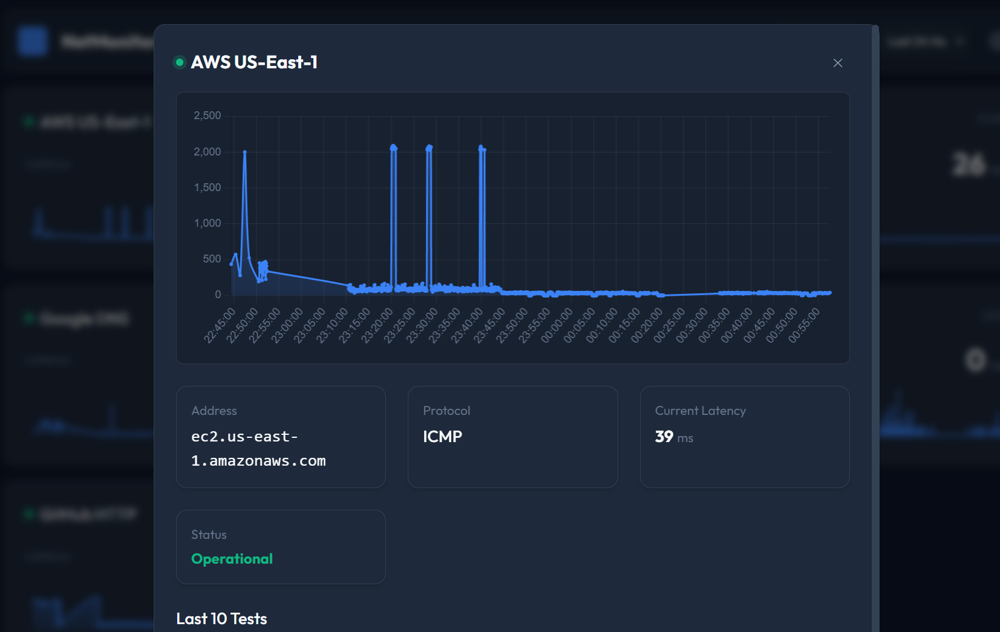

# NetMonitor

NetMonitor is a real-time desktop network monitoring application built with [Wails](https://wails.io/) (Go backend + HTML/JS frontend). It allows you to monitor the latency and availability of various network endpoints (ICMP, TCP, UDP, HTTP) with interactive charts and historical data.

## Features

- **Multi-Protocol Monitoring**: Support for ICMP (Ping), TCP, UDP, and HTTP/HTTPS checks.
- **Real-Time Dashboard**: Live status indicators and interactive latency charts powered by Chart.js.
- **Historical Data**: View performance trends over the last 24 hours, week, or month.
- **Cross-Platform**: Runs on Windows and Linux (macOS supported but not verified in this guide).
- **Configurable**: Easy JSON-based configuration for endpoints, thresholds, and intervals.

[](https://www.youtube.com/watch?v=fsdT9iVjCSM)

## Prerequisites

Before setting up the project, ensure you have the following installed:

- **Go** (v1.23+): [Download Go](https://go.dev/dl/)
- **Node.js** (v16+): [Download Node.js](https://nodejs.org/)
- **Wails CLI**:
  ```bash
  go install github.com/wailsapp/wails/v2/cmd/wails@latest
  ```

## Setup Instructions

### 🪟 Windows Setup

1.  **Install Prerequisites**: Ensure Go and Node.js are in your PATH.
    - Verify with `go version` and `npm --version`.
2.  **C Compiler (Optional/Recommended)**: Wails applications often require a C compiler (GCC).
    - Install [TDM-GCC](https://jmeubank.github.io/tdm-gcc/) or similar MinGW distribution.
3.  **Clone the Repository**:
    ```powershell
    git clone https://github.com/marcoshack/netmonitor.git
    cd netmonitor
    ```
4.  **Setup Workspace**:
    ```powershell
    make setup
    ```
5.  **Run in Development Mode**:
    ```powershell
    wails dev
    ```

### 🐧 Linux Setup (Ubuntu/Debian)

1.  **Install System Dependencies**:
    Wails requires GTK and WebKit libraries.
    ```bash
    sudo apt update
    sudo apt install build-essential libgtk-3-dev libwebkit2gtk-4.0-dev
    ```
2.  **Install Go & Node.js**: Use your distribution's package manager or official installers.
3.  **Clone and Setup**:
    ```bash
    git clone https://github.com/marcoshack/netmonitor.git
    cd netmonitor
    make setup
    ```
4.  **Run in Development Mode**:
    ```bash
    wails dev
    ```

### 🎩 Linux Setup (Fedora)

1.  **Install System Dependencies**:
    ```bash
    sudo dnf install gtk3-devel webkit2gtk3-devel go nodejs npm
    ```
    *Note: Ensure you have the 'Development Tools' group installed if building fails.*
    ```bash
    sudo dnf groupinstall "Development Tools"
    ```
2.  **Clone and Setup**:
    ```bash
    git clone https://github.com/marcoshack/netmonitor.git
    cd netmonitor
    make setup
    ```
3.  **Run**:
    ```bash
    wails dev
    ```

### 🍎 MacOS Setup

1.  **Install Command Line Tools**:
    Ensure you have the Xcode Command Line Tools installed.
    ```bash
    xcode-select --install
    ```
2.  **Install Go & Node.js**:
    It is recommended to use [Homebrew](https://brew.sh/) to manage packages.
    ```bash
    brew install go node
    ```
3.  **Clone and Setup**:
    ```bash
    git clone https://github.com/marcoshack/netmonitor.git
    cd netmonitor
    make setup
    ```
4.  **Run in Development Mode**:
    ```bash
    wails dev
    ```

## Building for Production

To create a single executable binary:

```bash
wails build
```

The output binary will be located in `build/bin/`.

**Note for Windows Users**:
If you are running the specific binary `netmonitor.exe` from the `build/bin` folder, ensure the `data` folder and `config.json` are present in that directory relative to the executable **if** you want portable behavior. However, by default, the app looks for configuration in the current working directory.

## Configuration

The application uses `config.json`. Example structure:

```json
{
  "regions": {
    "Default": {
      "endpoints": [
        { "name": "Google DNS", "type": "ICMP", "address": "8.8.8.8", "timeout": 1000 },
        { "name": "Local Web", "type": "HTTP", "address": "http://localhost", "timeout": 2000 }
      ]
    }
  },
  "settings": {
    "test_interval_minutes": 1,
    "data_retention_days": 90
  }
}
```

## License

This project is licensed under the MIT License - see the [LICENSE](LICENSE) file for details.
